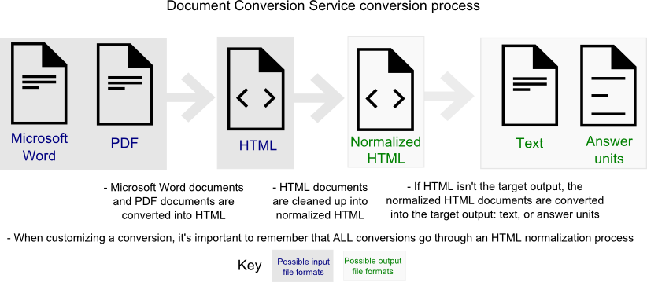

---

copyright:
  years: 2015, 2017
lastupdated: "2017-08-09"

---

{:shortdesc: .shortdesc}
{:new_window: target="_blank"}
{:tip: .tip}
{:pre: .pre}
{:codeblock: .codeblock}
{:screen: .screen}
{:javascript: .ph data-hd-programlang='javascript'}
{:java: .ph data-hd-programlang='java'}
{:python: .ph data-hd-programlang='python'}
{:swift: .ph data-hd-programlang='swift'}

# Advanced customization options

The {{site.data.keyword.documentconversionshort}} service has advanced customization options that allow you to define tags and structure in the conversion output. Customizing output is useful for removing redundant tags or for changing output to match existing styles or standards in your organization. The following sections describe the custom configuration options.
{: shortdesc}

## Getting started

The {{site.data.keyword.documentconversionshort}} service converts documents in several phases. For customization to work correctly, you need to account for every phase.



Every conversion starts by converting from the input format into HTML and then converts from HTML to normalized HTML. The normalization process converts the HTML tags to more standard tagging and structure. If HTML is not your target output, the service further converts the document from normalized HTML into your target output. To customize the conversion, you can invoke custom configurations for any or all of these phases. The [JSON example](#sampleconfig) captures all of these configuration phases.

## Defining the conversion target
{: #conversiontarget}

A `conversion_target` is required for every conversion to define the desired output type. Valid `conversion_target` values are `answer_units`, `normalized_html`, or `normalized_text`. The `conversion_target` is the only required JSON parameter. For example, if you wanted to convert a document into Answer Units, a valid JSON conversion file could have as little as the following:

```
{"conversion_target": "answer_units"}
```
{: screen}

## Microsoft Word input configurations
{: #dochtml}

<table>
  <caption>Table 1. Microsoft Word input heading font configurations</caption>
  <thead class="thead" align="left">
    <tr>
      <th>Key</th>
      <th>Description</th>
    </tr>
  </thead>
  <tbody>
    <tr>
      <td><code>level</code></td>
      <td>Required when defining any other font value. Heading level to be generated. When specifying a list of heading values, the first configuration in each heading list that matches something from the input document is the configuration that is applied to the conversion to create that heading type. Valid values are <code>1</code> (h1), <code>2</code> (h2), <code>3</code> (h3), <code>4</code> (h4), <code>5</code> (h5), and <code>6</code> (h6).</td>
    </tr>
    <tr>
      <td><code>min_size</code></td>
      <td>Minimum size font to be converted into the defined heading level. Default is <code>0</code>. Valid values are any font size above <code>0</code>.</td>
    </tr>
    <tr>
      <td><code>max_size</code></td>
      <td>Maximum size font to be converted into the defined heading level. Valid values are any font size larger than the minimum font size.</td>
    </tr>
    <tr>
      <td><code>bold</code></td>
      <td>Matches if the input is bold. Set to <code>true</code> when the input font that you want to be converted into a particular heading is bold. Set to <code>false</code> when the font isn't bold. Not setting this configuration means that the conversion ignores whether the input is bold.</td>
    </tr>
    <tr>
      <td><code>italic</code></td>
      <td>Matches if the input is italic. Set to <code>true</code> when the input font that you want to be converted into a particular heading is italic. Set to <code>false</code> when the font isn't italic. Default value is <code>false</code>.</td>
    </tr>
    <tr>
      <td><code>name</code></td>
      <td>The name of the font. If not defined all font names will be matched. Valid values are font names.</td>
    </tr>
  </tbody>
</table>

<table>
  <caption>Table 2. Microsoft Word input heading style configurations</caption>
  <thead class="thead" align="left">
    <tr>
      <th>Key</th>
      <th>Description</th>
    </tr>
  </thead>
  <tbody>
    <tr>
      <td><code>level</code></td>
      <td>Required when defining any other style value. Heading level to be generated. When specifying a list of heading values, the first configuration in each heading list that matches something from the input document is the configuration that is applied to the conversion to create that heading type Valid values are <code>1</code> (h1), <code>2</code> (h2), <code>3</code> (h3), <code>4</code> (h4), <code>5</code> (h5), and <code>6</code> (h6).</td>
    </tr>
    <tr>
      <td><code>names</code></td>
      <td>A list of style names that should be considered a heading in the conversion. Valid values are an array of style names.</td>
    </tr>
  </tbody>
</table>

Example Microsoft Word configuration section with fonts and styles:

```json
{
  "word": {
    "heading": {
      "fonts": [
        {
          "level": 1,
          "min_size": 24
        },
        {
          "level": 2,
          "min_size": 18,
          "max_size": 23,
          "bold": true
        },
        {
          "level": 3,
          "min_size": 14,
          "max_size": 17,
          "italic": false
        },
        {
          "level": 4,
          "min_size": 12,
          "max_size": 13,
          "name": "Times New Roman"
        }
      ],
      "styles": [
        {
          "level": 1,
          "names": ["pullout heading", "pulloutheading", "heading"]
        },
        {
          "level": 2,
          "names": ["subtitle"]
        }
      ]
    }
  }
}
```
{: codeblock}

By default, heading values are turned off at H5. These are the default values for each Microsoft Word heading font level:

```json
{
  "word": {
    "heading": {
      "fonts": [
        {
          "level": 1,
          "min_size": 24,
          "max_size": 80,
          "bold": false,
          "italic": false
        },
        {
          "level": 2,
          "min_size": 18,
          "max_size": 23,
          "bold": true,
          "italic": false
        },
        {
          "level": 3,
          "min_size": 14,
          "max_size": 17,
          "bold": false,
          "italic": false
        },
        {
          "level": 4,
          "min_size": 13,
          "max_size": 13,
          "bold": true,
          "italic": false
        }
      ]
    }
  }
}
```
{: codeblock}

## PDF input configurations
{: #pdfhtml}

<table>
  <caption>Table 3. PDF heading font configurations</caption>
  <thead>
    <tr>
      <th>Key</th>
      <th>Description</th>
    </tr>
  </thead>
  <tbody>
    <tr>
      <td><code>level</code></td>
      <td>Required when defining any other font value. Heading level to be generated. When specifying a list of heading values, the first configuration in each heading list that matches something from the input document is the configuration that is applied to the conversion to create that heading type. Valid values are <code>1</code> (h1), <code>2</code> (h2), <code>3</code> (h3), <code>4</code> (h4), <code>5</code> (h5), and <code>6</code> (h6).</td>
    </tr>
    <tr>
      <td><code>min_size</code></td>
      <td>Minimum size font to be converted into the defined heading level. Default is <code>0</code>. Valid values are any font size above <code>0</code>.</td>
    </tr>
    <tr>
      <td><code>max_size</code></td>
      <td>Maximum size to be converted into the defined heading level. Valid values are any font size larger than the minimum font size.</td>
    </tr>
    <tr>
      <td><code>bold</code></td>
      <td>Matches if the input is bold. Set to <code>true</code> when the input font that you want to be converted into a particular heading is bold. Set to <code>false</code> when the font isn't bold. Not setting this configuration means that the conversion ignores whether the input is bold.</td>
    </tr>
    <tr>
      <td><code>italic</code></td>
      <td>Matches if the input is italic. Set to <code>true</code> when the input font that you want to be converted into a particular heading is italic. Set to <code>false</code> when the font isn't italic. Default value is <code>false</code>.</td>
    </tr>
    <tr>
      <td><code>name</code></td>
      <td>The name of the input font. If not defined all font names will be matched. Valid values are font names.</td>
    </tr>
  </tbody>
</table>

Example PDF configuration section with fonts and styles:

```json
{
  "pdf": {
    "heading": {
      "fonts": [
        {"level": 1, "min_size": 24},
        {"level": 2, "min_size": 18, "max_size": 23, "bold": true},
        {"level": 3, "min_size": 14, "max_size": 17, "italic": false},
        {"level": 4, "min_size": 12, "max_size": 13, "name": "Times New Roman"}
      ]
    }
  }
}
```
{: codeblock}

By default, heading values are turned off at H5. These are the default values for each PDF heading font level:

```json
{
  "pdf": {
    "heading": {
      "fonts": [
        {
          "level": 1,
          "min_size": 24,
          "max_size": 80
        },
        {
          "level": 2,
          "min_size": 18,
          "max_size": 24,
          "bold": false,
          "italic": false
        },
        {
          "level": 2,
          "min_size": 18,
          "max_size": 24,
          "bold": true
        },
        {
          "level": 3,
          "min_size": 13,
          "max_size": 18,
          "bold": false,
          "italic": false
        },
        {
          "level": 3,
          "min_size": 13,
          "max_size": 18,
          "bold": true
        },
        {
          "level": 4,
          "min_size": 11,
          "max_size": 13,
          "bold": true,
          "italic": false
        }
      ]
    }
  }
}
```
{: codeblock}

## HTML normalization configurations
{: #htmlhtml}

<table>
  <caption>Table 4. Normalized HTML configurations</caption>
  <thead>
    <tr>
      <th>Key</th>
      <th>Description</th>
    </tr>
  </thead>
  <tbody>
    <tr>
      <td><code>exclude_tags_completely</code></td>
      <td>Defines tags that should be removed completely with their content. Valid values are a list of tags.</td>
    </tr>
    <tr>
      <td><code>exclude_tags_keep_content</code></td>
      <td>Defines tags that should be removed, but content is kept. Valid values are a list of tags.</td>
    </tr>
    <tr>
      <td><code>keep_content.xpaths</code></td>
      <td>Specifies a list of XPaths that identify content that is converted. If this value is set, anything that matches one of the XPaths are included in the output. The inclusions specified by this parameter are processed after any processing specified by <code>exclude_content_xpaths</code>.</td>
    </tr>
    <tr>
      <td><code>exclude_content.xpaths</code></td>
      <td>Specifies the values to identify the main content that is not converted. If this value is set, anything that matches one of the XPaths is excluded from the output.</td>
    </tr>
    <tr>
      <td><code>keep_tag_attributes</code></td>
      <td>List of attributes to keep in the HTML tags. Can only be specified if exclude_tag_attributes is not specified. Valid values are <code>EVENT_ACTIONS</code>, <code>*</code>, or an array of individual attributes. Selecting <code>EVENT_ACTIONS</code> includes all of the JavaScript action attributes. Selecting <code>*</code> includes all attributes. For best results, include <code>rowspan</code>, <code>colspan</code>, and <code>border</code>.</td>
    </tr>
    <tr>
      <td><code>exclude_tag_attributes</code></td>
      <td>List of attributes to strip from the HTML tags. Can only be specified if keep_tag_attributes is not specified. Valid values are <code>EVENT_ACTIONS</code>, <code>*</code>, or an array of individual attributes. Selecting <code>EVENT_ACTIONS</code> excludes all of the JavaScript action attributes. Selecting <code>*</code> excludes all attributes. For best results, do not exclude <code>rowspan</code>, <code>colspan</code>, or <code>border</code>.</td>
    </tr>
  </tbody>
</table>

Example HTML normalization configurations:

```json
{
  "normalized_html": {
    "exclude_tags_completely": ["script", "sup"],
    "exclude_tags_keep_content": ["font", "em", "span"],
    "keep_content": {
      "xpaths": ["//body/div[@id='content']"]
    },
    "exclude_content": {
      "xpaths": ["//*[@id='footer']", "//*[@id='navigation']"]
    },
    "keep_tag_attributes": ["*"]
  }
}
```
{: codeblock}

## Answer Unit output configurations
{: #htmlau}

<table>
  <caption>Table 5. Answer Unit output configurations</caption>
  <thead>
    <tr>
      <th>Key</th>
      <th>Description</th>
    </tr>
  </thead>
  <tbody>
    <tr>
      <td><code>selector_tags</code></td>
      <td>Defines the heading level that splits into answer units. Valid values are <code>h1</code>, <code>h2</code>, <code>h3</code>, <code>h4</code>, <code>h5</code>, <code>h6</code>, or an array of these values. By default, h1 and h2 headings with their content are split into answer units.</td>
    </tr>
  </tbody>
</table>

Example `answer_units` configuration section:

```json
{
  "answer_units": {
    "selector_tags": ["h1", "h2", "h3", "h4", "h5", "h6"]
  }
}
```
{: codeblock}

## JSON Example
{: #sampleconfig}

This JSON example captures three phases of conversion:

```json
{
  "conversion_target": "answer_units",
  "word": {
    "heading": {
      "fonts": [
        {
          "level": 1,
          "min_size": 24
        },
        {
          "level": 2,
          "min_size": 18,
          "max_size": 23,
          "bold": true
        },
        {
          "level": 3,
          "min_size": 14,
          "max_size": 17,
          "italic": false
        },
        {
          "level": 4,
          "min_size": 12,
          "max_size": 13,
          "name": "Times New Roman"
        }
      ],
      "styles": [
        {
          "level": 1,
          "names": ["pullout heading", "pulloutheading", "heading"]
        },
        {
          "level": 2,
          "names": ["subtitle"]
        }
      ]
    }
  },
  "normalized_html": {
    "exclude_tags_keep_content": ["font", "em", "span", "strong", "code"]
  },
  "answer_units": {
    "selector_tags": ["h1", "h2", "h3", "h4", "h5", "h6"]
  }
}
```
{: codeblock}

This JSON defines converting a Microsoft Word document into Answer Units with the following customizations:

-   Changing the heading level that is generated from your Word document.
-   Removing tags such as `font`, `em`, `span`, `strong`, and `code` but keeping their content.
-   Splitting into Answer Units using h1 through h6 headings.
