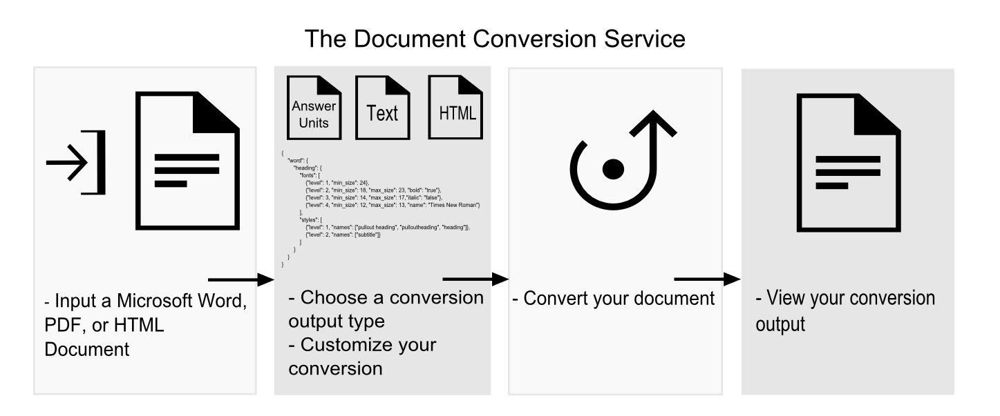

---

copyright:
  years: 2015, 2017
lastupdated: "2017-08-11"

---

{:shortdesc: .shortdesc}
{:new_window: target="_blank"}
{:tip: .tip}
{:pre: .pre}
{:codeblock: .codeblock}
{:screen: .screen}
{:javascript: .ph data-hd-programlang='javascript'}
{:java: .ph data-hd-programlang='java'}
{:python: .ph data-hd-programlang='python'}
{:swift: .ph data-hd-programlang='swift'}

# About

**Important:** Starting on **11-03-2017**, it will no longer be possible to create a new instance of {{site.data.keyword.documentconversionshort}} on Bluemix. Existing service instances will be supported until **10-03-2018**. To continue using features, you will need to [migrate](/docs/services/discovery/migrate-dcs-rr.html).  **Note:** May not apply in select Dedicated environments.

The {{site.data.keyword.documentconversionfull}} service converts a single HTML, PDF, or Microsoft Word&trade; document. The input document is transformed into normalized HTML, plain text, or a set of JSON-formatted Answer Units that can be used with other {{site.data.keyword.watson}} services, like the {{site.data.keyword.watson}} {{site.data.keyword.retrieveandrankshort}} service.
{: shortdesc}

## Basic Flow
{: #basicflow}

To use the {{site.data.keyword.documentconversionshort}} service to convert a document, submit a single input document and select a conversion output type. You can optionally customize the conversion. You then convert the document and view the output. To quickly start using the service, see [Getting started tutorial](/docs/services/document-conversion/getting-started.html).

## Supported languages
{: #languages}

The {{site.data.keyword.documentconversionshort}} service supports content in English, French, German, Japanese, Italian, Brazilian Portuguese, Korean, and Spanish.

## Try out the service
{: #getstarted}

To begin working with the {{site.data.keyword.documentconversionshort}} service, do the following:

-   See a [quick demo ](https://document-conversion-demo.mybluemix.net/){: new_window} of the {{site.data.keyword.documentconversionshort}} service in action. The demo application lets you upload a test HTML, PDF, or Microsoft Word document and convert it into Answer Units or HTML.
-   Start using the {{site.data.keyword.documentconversionshort}} service by doing a basic conversion and a basic conversion with customizations. For a step-by-step guide for performing the conversion with cURL, see [Getting started tutorial](/docs/services/document-conversion/getting-started.html).
-   See the [API reference ](https://www.ibm.com/watson/developercloud/document-conversion/api/v1/){: new_window} for detailed information about the methods and parameters of the service.
